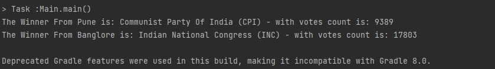

# Election Result Processing

## Problem Description
Election Results

It's election night! Exciting! We have a feed of election results from a data supplier.
They will supply us a file which will be updated throughout the night as results come in.

A result will consist of:
- A constituency
- A repeating set of pairs with the party code and the votes cast

So for example:

Banglore, 11014, BJP, 17803, INC, 4923, CPI, 2069, NCP
Pune, 9389, CPI, 4829, BJP, 3375, NCP, 3371, BSP, 309, INC,

Party Codes -

BJP - Bhartiya Janta Party
INC - Indian National Congress
BSP - Bahujan Samaj Party
CPI - Communist Party of India
NCP - Nationalist Congress Party
IND - Independant

We want to transform this into a standard result that shows:

- the constituency name
- translates the party code into a full name
- shows the winner of the constituency
  Extensions -

- shows the share of the vote as a percentage of all the votes cast
- winning party i.e. party with maximum number of seats

### Controller
- **FileController**: Accepts input file from the user.
   Behaviour:readFile(String filepath)
- **ElectionController**: Processes election data to calculate winners and saves results.
    Behaviour:getWinner()

### Outer Service

- **FileReaderService**: readfile(String filePath)
- **ElectionService**: getWinner()

### Domain Model

- **PartyNameMapper**:getPartyFullName(String partyCode)

### Inner Service
- **ElectionResultAnalyser**: void analyseWinner()
- **DataExtractor**:ExtractData(List<String>)
- **VoteCalculator**: calculateVotes(Map<Map<Integer,String>>)
- **ResultAnnouncer**:displayWinner()

### Repository
- **ElectionDataRepository**: Stores raw election data in a structured format.
- **ElectionResultRepository**: Stores winners' data including city names, party full names, vote counts.

## Configuration Files
1. **ValidCityName**: Contains configurations for city names.
2. **ValidPartyCodes**: Contains configurations for party codes and their corresponding full names.

## Workflow

1. **File Processing**: The FileController accepts the input file and hands it over to the Outer Service layer.
2. **Parsing and Validation**: The Parsing service reads and validates the input data, saving it into the ElectionDataRepository.
3. **Winner Calculation**: The ResultCalculator service calculates winners for each city using the VoteCalculator.
4. **Data Storage**: Election results, including winners' data, are stored in the ResultDataRepository.

## Output
The output consists of city names along with the full names of parties and their respective vote counts.

